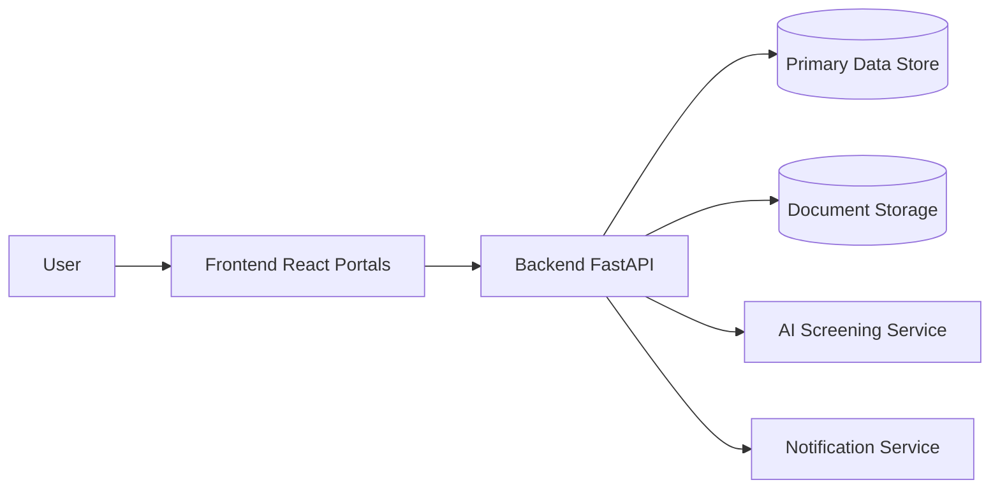
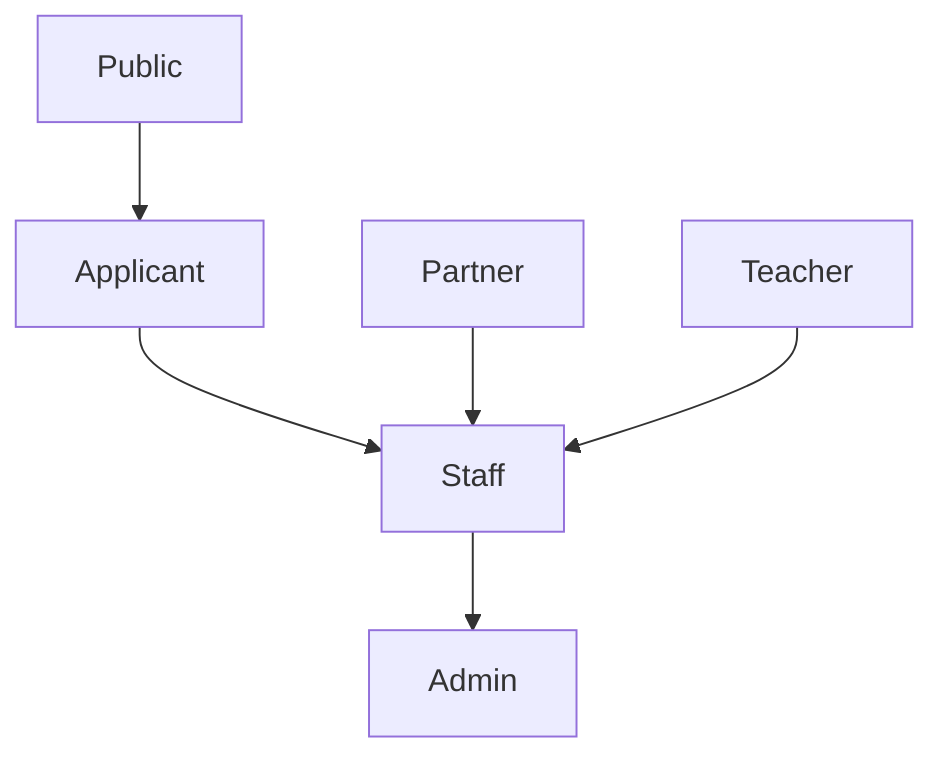
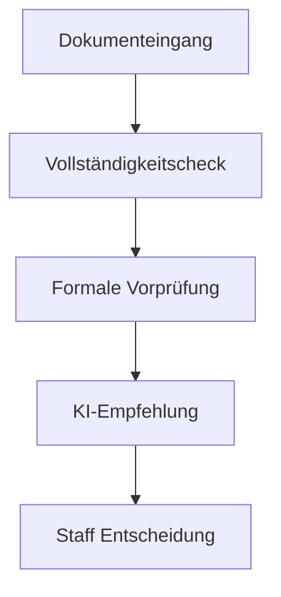

# Architektur-Überblick

> Zurück zur Einstiegsdoku: [README](../../README.md)

## Zweck

Diese Seite beschreibt die produktive Zielarchitektur, die bestehenden Portalgrenzen und die verbindlichen Schnittstellen zwischen Frontend, Backend und AI-Screening.

## Systemkontext und Container-Sicht

### Kernkomponenten

- Frontend-Portale: Public, Applicant, Staff, Admin, Partner
- Backend-Services: Auth, Applications, Tasks, Messaging, AI-Screening
- Persistenz: Datenbank + Dokumentenablage
- Betriebsservices: Notifications, Audit, Export

## Rollen- & Rechtefluss

Rollen-Details: [docs/roles-and-permissions.md](../roles-and-permissions.md)

## AI-Screening-Entscheidungsfluss

Entscheidungsgrenzen und Evidenzmodell:

- [Regelbasis](../ai-screening/rule-basis.md)
- [Entscheidungsgrenzen](../ai-screening/decision-boundaries.md)
- [Evidenzmodell](../ai-screening/evidence-model.md)

## Integrations- und Betriebsartefakte

- Release-Artefakt: [release/golive_checklist.yaml](../../release/golive_checklist.yaml)
- QA/Release Gates: [docs/qa-release/gates.md](../qa-release/gates.md)
- Governance: [docs/governance/pr-policy.md](../governance/pr-policy.md)
- ADR-Index: [docs/adr/README.md](../adr/README.md)

## Dokumentverantwortung

- **Owner:** Architecture Guild / Platform Team
- **Update-Prozess:** Bei jeder PR mit Änderungen an Routing, Service-Grenzen, Datenflüssen, Integrationen oder AI-Screening-Prozess.
